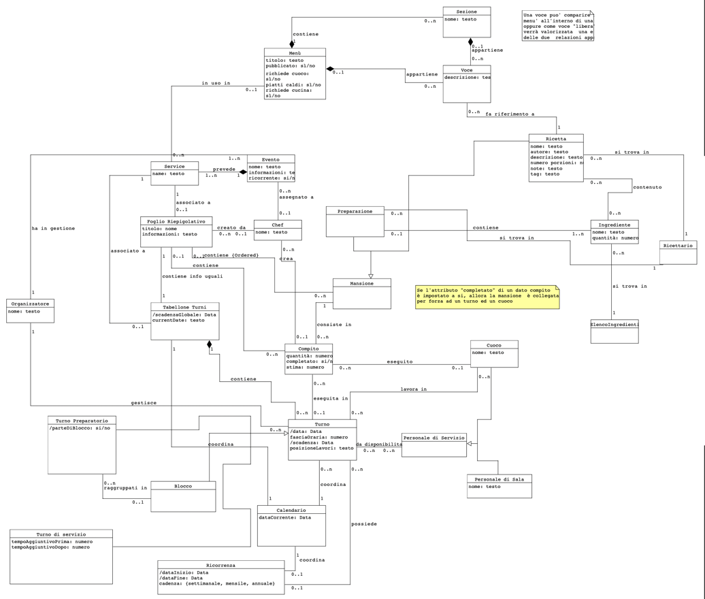
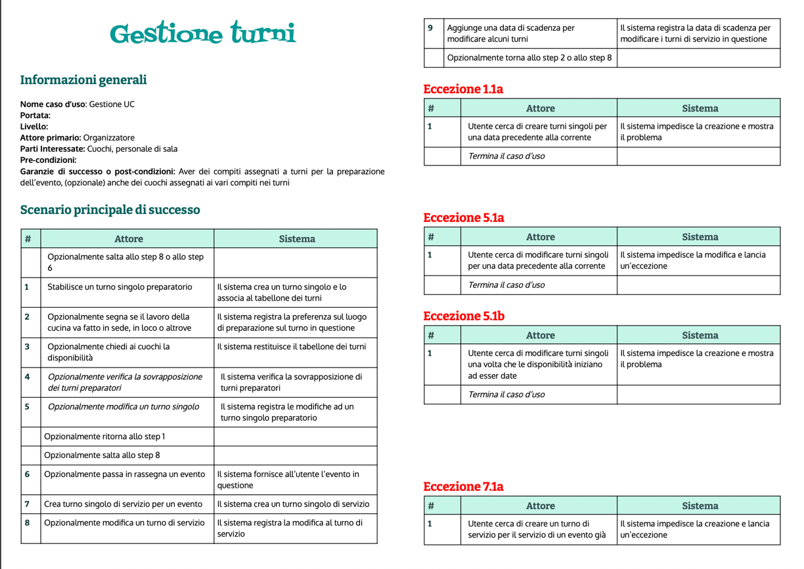
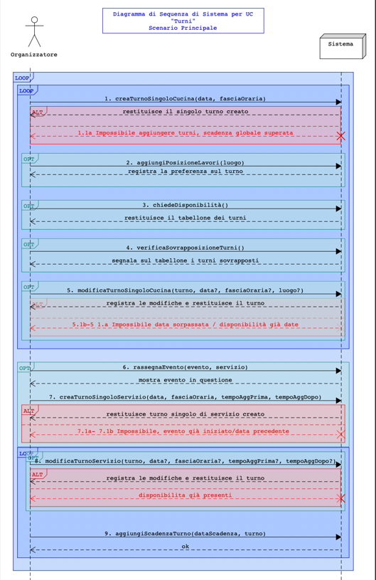
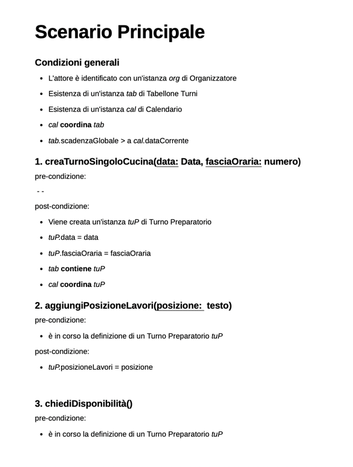
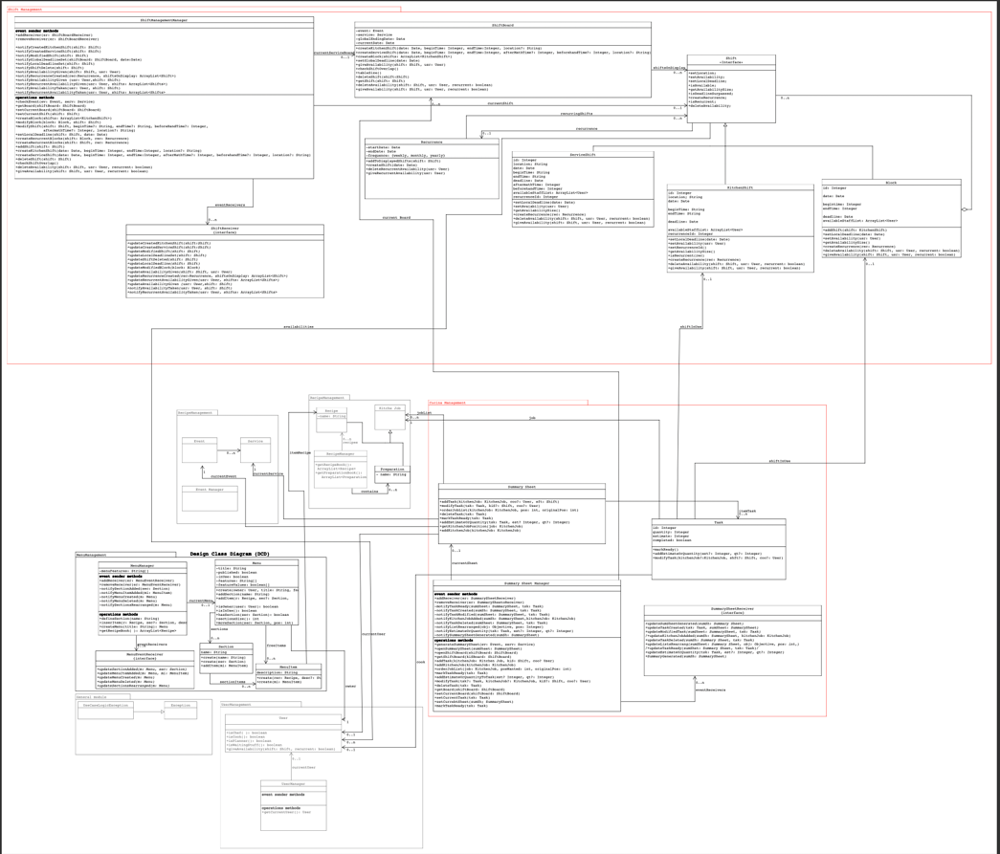
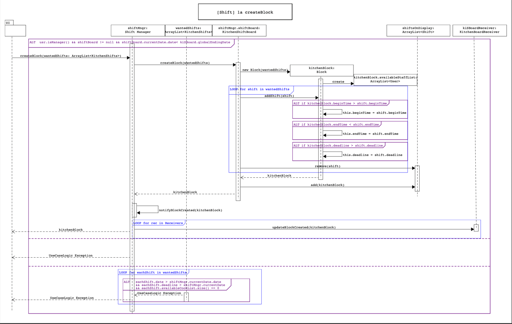

# Cat&Ring
**I apologize in advance if the examples picked in this README have low quality pictures, you can find the original documentation in the documentation folder and the example pictures being illustrated under static_files for a clearer resolution**

I developed a backend system around two use cases described in the agile documentation available in the documentation folder under the name "Project Agile Requisites". 

There were two main use cases: the process with which the kitchen work would get organized, namely who would prepare which dishes during what shift and the other one regarding shift organization
for both waiters and kitchen staff.

## Conceptual and requisite analysis phase

The domain model below describes the relations developed in a preliminary conceptual phase

In the same phase of conceptual definition and requisites management I modelled two hypothetical user flows in two possible ways: a sequential step by step textual description of the main flow
with possible alternative scenarios and a conceptual sequential diagram describing as a black box model the user-system interaction

(Below you can see two examples of the complete documentation under the documentation folder)

Between this conceptual phase and the next more software class related documentation I developed some Contracts describing precisely in natural language what each of these steps meant 
in terms of the domain model objects and relations.

(You can find an example below)

## Detailed Sequence Diagrams and Architecture

As a last phase before and during code implementation I developed the Architectural diagram and the Detailed Sequence Diagrams for the most pressing actions being done in the application

### Architecture

### Example sequence diagram

# Least but not last

You can find under the src folder the code and the relative functional testing of these two use cases being analyzed

